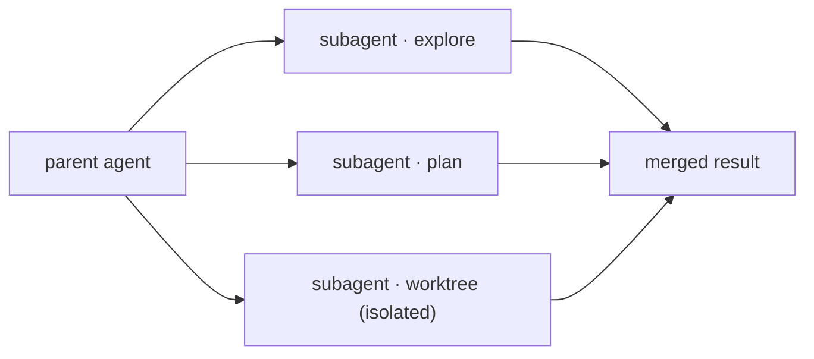
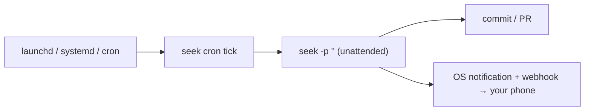

<p align="center">
  
  
  
  
  
</p>

**Languages**: English · [中文](README.zh.md)

# seek

> **Not an agent demo — a local agent platform that plans, spawns a team of sub-agents, and ships while you sleep.**

A coding agent that runs as a single **~5 MB Go binary** in your terminal — **no daemon, no telemetry, no Python/Node runtime, no seek-operated backend.** You bring your own model key: **DeepSeek-first**, and it also speaks to OpenAI / Anthropic / Gemini and other OpenAI-compatible endpoints (such as KIMI).

```
┌─ seek · deepseek-v4-flash ─────────────── cache 96% · saved $0.42 ─┐
│ /agents (2 active)  ·  /worktrees (1)  ·  cron: next @14:30 (12m)  │
└────────────────────────────────────────────────────────────────────┘
```

---

## ⚡ Install (single binary, no toolchain)

**macOS / Linux:**

```bash
OS=$(uname -s | tr '[:upper:]' '[:lower:]')
ARCH=$(uname -m | sed 's/x86_64/amd64/;s/aarch64/arm64/')
VER=$(curl -fsSL https://api.github.com/repos/whyiyhw/seek/releases/latest | sed -nE 's/.*"tag_name":[[:space:]]*"v([^"]+)".*/\1/p')
curl -fsSL "https://github.com/whyiyhw/seek/releases/download/v${VER}/seek_${VER}_${OS}_${ARCH}.tar.gz" \
  | sudo tar -xz -C /usr/local/bin seek
seek
```

First launch walks you through picking a provider and saving an API key — that's it. **Windows**: see [`docs/guide-windows.md`](docs/guide-windows.md). **Upgrade**: `seek -upgrade` (sha256-verified, atomic) or `/upgrade` in the TUI.

---

## What it does — the three claims in the tagline, each backed by shipping code

### 🧭 1. Plans before it acts

`/plan` puts seek in a **gated workflow**: `analyze → propose → you approve → execute`. It stays **read-only** until you approve a concrete, step-by-step plan rendered as a live TUI task list — no runaway edits. Push back mid-execution and it re-plans *without redoing finished work*. State is reconstructed from the transcript, so `seek -resume` picks the plan back up exactly where it left off.

### 👥 2. Spawns a team of sub-agents

seek fans a task out to sub-agents that work **in parallel, each isolated in its own git worktree** so they never collide — one explores, one drafts a plan, one implements in isolation. Permissions narrow **monotonically** (a child can never be less restricted than its parent), and token cost aggregates to the parent's status bar. Watch it live with `/agents` and `/worktrees`.



### 🌙 3. Ships while you sleep

**Zero-daemon scheduling** — seek leans on your OS scheduler (launchd / systemd / Task Scheduler); nothing resident. Schedule prompts with `seek cron`, let the model schedule its own follow-up with the `schedule_wakeup` tool, or fire a run from CI/IDE by dropping a trigger file. An unattended run does the work, commits it, and **pushes the result to your phone** via webhook (ntfy / Slack / Discord / any URL) — so you wake up to a finished commit, not a TODO.



---

## Why it's real, not a concept

seek is a mature, daily-driver codebase, not a weekend build:

- **~85k lines of Go** (~44k non-test) across **66 packages**, tested with **`-race` on macOS / Linux / Windows** in CI.
- **PRD-driven** — [`docs/prd/`](docs/prd/) holds the v0–v6 umbrellas plus 14 feature PRDs; a documented [pitfalls log](docs/pitfalls.md) and a behavioral [eval harness](eval/) keep it honest.
- Zero external dependencies in the DeepSeek client; **stdlib-first** throughout.

### 💰 An order of magnitude cheaper

DeepSeek input pricing (from [`internal/pricing/pricing.go`](internal/pricing/pricing.go)):

| Metric | DeepSeek V4-Flash | DeepSeek V4-Pro | Claude Sonnet 4 |
|---|---|---|---|
| Input (cache miss) | **$0.14** / 1M tok | **$0.435** / 1M tok¹ | $3 / 1M tok |
| Input (prefix-cache hit) | **$0.0028** / 1M tok | **$0.003625** / 1M tok | $0.30 / 1M tok |
| Output | **$0.28** / 1M tok | **$0.87** / 1M tok | $15 / 1M tok |
| Off-peak window² | **50% off all of the above** | **50% off all of the above** | — |

> ¹ V4-Pro is at a 75%-off promo; full rack rate is $1.74 / $0.0145 / $3.48.  ² 00:30–08:30 Beijing time.

Measured **prefix-cache hit rate 95–97%**. That's engineering discipline, not luck: tool schemas are byte-stable `[]byte` constants, tool output is capped at write-time, and history is never rewritten before send. The status bar shows the live hit ratio and dollars saved.

### 📚 Portable Agent Skills

Compatible with the [Anthropic Agent Skills format](https://docs.anthropic.com/en/docs/claude-code/skills) (`<dir>/SKILL.md` + frontmatter) — any Claude Code skill installs **unmodified**. Author, install, and run modular, reusable skills:

```bash
seek skill create my-skill                              # scaffold one
seek skill install https://github.com/foo/bar#v1.0.0    # git URL / tarball / local path
seek skill list                                         # what's loaded
```

Built-ins include **`code-review`** (effort-graded review that spawns sub-agents and can `--fix` through plan-mode, or `--comment` to a PR), `plan-mode`, `dual-model`, `go-test-runner`.

### And more

- **Three-tier memory** — S (session) / M (project, with decay-score GC) / L (cross-project "soul", distilled by `seek -dream`).
- **MCP client** — pass through any MCP server's tools.
- **Checkpoint safety net** — per-turn git snapshot + file-level `/undo` `/redo` `/restore`.
- **Dual-axis permissions** — Preference (Deny / Ask / Yolo) × Workflow (None / PlanAnalyze / PlanExecute); workflow always trumps preference.
- **Shell hooks**, **JSON-RPC 2.0 server mode** (IDE integration), and DeepSeek extras (V4 reasoning via the `think` tool; FIM endpoint for 5–10× cheaper small edits; off-peak pricing countdown).

---

## Tools & commands

```bash
seek                       # interactive TUI
seek -p '<prompt>'         # one-shot print mode (pipeline-friendly)
seek -rpc                  # JSON-RPC 2.0 server (IDE integration)
seek -resume <sid>         # resume a session (-continue for the most recent)

seek skill      install / list / stats / uninstall / update
seek memory     list / show / search / archive
seek cron       create / list / run / delete / tick / config check
seek worktree   list / gc
seek checkpoint list / clean        # with seek undo / seek redo
seek hooks      list / check / trust / audit
```

Every subcommand is also a `/<name>` inside the TUI. TUI-only: `/plan`, `/steer`, `/agents`, `/worktrees`, `/distill`, `/code-review`. Full list: `/help`.

---

## Roadmap

Everything below ships in the current **v0.7.1** release:

| Phase | What landed |
|---|---|
| Foundations (M0–M10) | DeepSeek client · agent loop · multi-provider · sessions · skills · hooks · checkpoints · plan-mode v2 · permission refactor · MCP client · webfetch |
| Orchestration (柱 G/H) | sub-agents + worktrees · cron + self-scheduled wakeups + file triggers + OS notifications |
| Single-point tools (柱 I/J/M) | AskUserQuestion v2 · composite `code-review` skill · **mobile-push webhook bridge** |

Next up (柱 K / L): Monitor + background bash · LSP tool.

Full design docs: [`docs/prd/`](docs/prd/) · contributing: [`CONTRIBUTING.md`](CONTRIBUTING.md) / [`AGENTS.md`](AGENTS.md) · pitfalls: [`docs/pitfalls.md`](docs/pitfalls.md)

---

## Open source

[MIT](LICENSE). No region lock, no signup, no mandatory telemetry — builders anywhere in the world are welcome. Inspired by [`earendil-works/pi`](https://github.com/earendil-works/pi) (MIT); attribution in [`NOTICE`](NOTICE).

---

*~85k lines of Go (~44k non-test) · 66 packages · `-race` on macOS / Linux / Windows*
