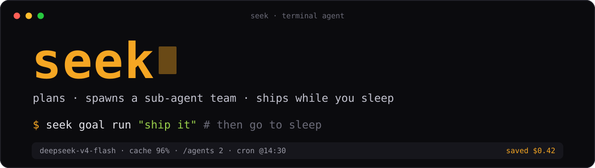

<p align="center">
  
</p>

<p align="center">
  <strong>Not an agent demo — a local agent platform that plans, spawns a team of sub-agents, and ships while you sleep.</strong>
</p>

<p align="center">
  
  
  
  
  &nbsp;·&nbsp; <a href="README.zh.md">中文</a>
</p>

A coding agent that runs as a single **static Go binary** in your terminal — a **~6 MB download**, **no daemon, no telemetry, no Python/Node runtime, no seek-operated backend.** Bring your own model key: **DeepSeek-first**, and it also speaks OpenAI / Anthropic / Gemini and any OpenAI-compatible endpoint (KIMI, …).

---

## Why seek is different

The three claims in the tagline, each backed by shipping code:

- **🧭 Plans before it acts** — `/plan` gates work behind `analyze → propose → you approve → execute`. Read-only until you approve a step-by-step task list; push back mid-run and it re-plans *without redoing finished work*. State rebuilds from the transcript, so `seek -resume` resumes the plan exactly where it left off.
- **👥 Spawns a team of sub-agents** — fans a task out to sub-agents that run **in parallel, each isolated in its own git worktree** so they never collide. Permissions narrow monotonically; cost aggregates to the parent's status bar. Watch live with `/agents` · `/worktrees`. → [guide](docs/guide-subagent.md)
- **🌙 Ships while you sleep** — **zero-daemon** scheduling on your OS (launchd / systemd / Task Scheduler). `seek cron`, a model-scheduled `schedule_wakeup`, or a CI trigger file runs unattended, commits, and **pushes the result to your phone** (ntfy / Slack / Discord / any URL). → [guide](docs/guide-cron.md)

---

## Install

```bash
OS=$(uname -s | tr '[:upper:]' '[:lower:]')
ARCH=$(uname -m | sed 's/x86_64/amd64/;s/aarch64/arm64/')
VER=$(curl -fsSL https://api.github.com/repos/whyiyhw/seek/releases/latest | sed -nE 's/.*"tag_name":[[:space:]]*"v([^"]+)".*/\1/p')
curl -fsSL "https://github.com/whyiyhw/seek/releases/download/v${VER}/seek_${VER}_${OS}_${ARCH}.tar.gz" \
  | sudo tar -xz -C /usr/local/bin seek
seek
```

First launch walks you through picking a provider + saving a key — that's it. **Windows**: [`docs/guide-windows.md`](docs/guide-windows.md). **Upgrade**: `seek -upgrade` (sha256-verified, atomic) or `/upgrade` in the TUI.

```bash
seek                                    # interactive TUI
seek -p "what does internal/agent do?"  # one-shot, pipeline-friendly
seek goal run "all tests in ./auth pass" # autonomous: work until the goal is met
```

---

## An order of magnitude cheaper

DeepSeek pricing (from [`internal/pricing/pricing.go`](internal/pricing/pricing.go)):

| Metric | DeepSeek V4-Flash | DeepSeek V4-Pro | Claude Sonnet 4 |
|---|---|---|---|
| Input (cache miss) | **$0.14** / 1M | **$0.435** / 1M¹ | $3 / 1M |
| Input (cache hit) | **$0.0028** / 1M | **$0.003625** / 1M | $0.30 / 1M |
| Output | **$0.28** / 1M | **$0.87** / 1M | $15 / 1M |
| Off-peak² | **−50%** | **−50%** | — |

<sub>¹ V4-Pro at a 75%-off promo (rack rate $1.74 / $0.0145 / $3.48). ² 00:30–08:30 Beijing time.</sub>

Measured **95–97% prefix-cache hit** — discipline, not luck: tool schemas are byte-stable `[]byte` constants, tool output is capped at write-time, and history is never rewritten before send. The status bar shows the live ratio + dollars saved.

---

## Features

| | |
|---|---|
| **Autopilot** | unattended end-to-end: decompose → parallel worktree fleet → commit → push. [📘](docs/guide-autopilot.md) |
| **`/goal`** | loop across turns until a cheap model judges a condition met — TUI / headless / cron. [📘](docs/guide-goal.md) |
| **OS sandbox** | seatbelt (macOS) / landlock (Linux) — kernel-level confinement, zero runtime deps. [📘](docs/guide-sandbox.md) |
| **ACP / Zed** | run seek as an editor agent via the Agent Client Protocol. [📘](docs/guide-zed.md) |
| **Portable skills** | Anthropic Agent Skills format — any Claude Code skill installs unmodified. [📘](docs/guide-skills.md) |
| **Three-tier memory** | session · project (decay-score GC) · cross-project "soul" (`seek -dream`). [📘](docs/guide-memory.md) |
| **Checkpoints** | per-turn git snapshot + file-level `/undo` `/redo` `/restore`. [📘](docs/guide-checkpoint.md) |
| **Background jobs** | detach long builds/servers → `bg-N`; `monitor` polls / waits / kills. [📘](docs/guide-background.md) |
| **Semantic references** | LSP "who calls this?" (gopls / pyright / tsserver), grep fallback. [📘](docs/guide-references.md) |
| **Offline image OCR** | `@img.png` or pasted images → local OCR, no VLM / no network. [📘](docs/guide-ocr.md) |
| **Code review** | effort-graded diff review with `--fix` and `--comment`. [📘](docs/guide-code-review.md) |
| **MCP client** | pass through any MCP server's tools. [📘](docs/guide-mcp.md) |
| **Push to phone** | cron / autopilot / long-turn completions → webhook. [📘](docs/guide-webhooks.md) |
| **Dual-axis permissions** | Preference (Deny / Ask / Yolo) × Workflow (None / Plan-analyze / Plan-execute). |

Plus shell hooks, a JSON-RPC 2.0 server mode, and DeepSeek extras (V4 reasoning via `think`, FIM for 5–10× cheaper small edits, off-peak countdown).

---

## Commands

```bash
seek                       # interactive TUI
seek -p '<prompt>'         # one-shot print mode (pipeline-friendly)
seek -resume <sid>         # resume a session (-continue for the most recent)
seek -rpc                  # JSON-RPC 2.0 server (IDE integration)
seek acp                   # Agent Client Protocol server (Zed, …)

seek goal       run "<condition>"          # autonomous loop until met
seek skill      install / list / stats / uninstall / update
seek memory     list / show / search / archive
seek cron       create / list / run / delete / tick   # --autopilot / --goal
seek worktree   list / gc
seek checkpoint list / clean               # + seek undo / seek redo
seek hooks      list / check / trust / audit
```

Every subcommand is also `/<name>` in the TUI. TUI-only: `/plan` `/goal` `/steer` `/agents` `/worktrees` `/distill` `/code-review`. Full list: `/help`.

---

## Built for real, not a weekend build

**~85k lines of Go** (~44k non-test) across **66 packages**, `-race` tested on macOS / Linux / Windows in CI. PRD-driven — [`docs/prd/`](docs/prd/) holds the v0–v7 design history; a [pitfalls log](docs/pitfalls.md) and a behavioral [eval harness](eval/) keep it honest. Zero external deps in the DeepSeek client; **stdlib-first** throughout. Current release: **v0.8.1**.

Docs: [`docs/`](docs/) · contributing: [`CONTRIBUTING.md`](CONTRIBUTING.md) / [`AGENTS.md`](AGENTS.md)

---

## Open source

[MIT](LICENSE). No region lock, no signup, no mandatory telemetry — builders anywhere are welcome. Inspired by [`earendil-works/pi`](https://github.com/earendil-works/pi) (MIT); attribution in [`NOTICE`](NOTICE).
