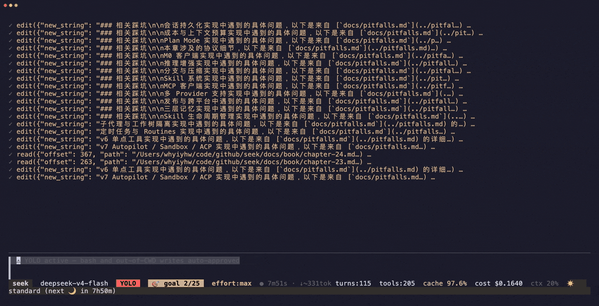
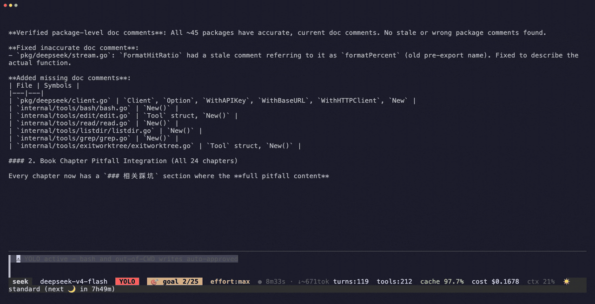

<p align="center">
  
</p>

<p align="center">
  <strong>不是又一个 agent demo——而是一个本地 agent 平台：会规划、能派出一队子代理、在你睡觉时把活干完。</strong>
</p>

<p align="center">
  
  
  
  
  &nbsp;·&nbsp; <a href="README.md">English</a>
</p>

一个编码 agent，以单个 **静态 Go 二进制** 跑在你的终端里——**~6 MB 下载体积**、**无常驻 daemon、无 telemetry、不依赖 Python/Node 运行时、没有 seek 自营后端。** 自带模型 key 即可：**DeepSeek 优先**，同时也讲 OpenAI / Anthropic / Gemini 以及任何 OpenAI 兼容端点（KIMI、…）。

---

## seek 与众不同之处

标语里的三句话，每句都有已落地的代码兜底：

- **🧭 先规划，再动手** — `/plan` 把工作卡在 `分析 → 提方案 → 你批准 → 执行` 之后。批准前全程只读；执行中你可以中途插话，它会**在不重做已完成步骤的前提下**重新规划。状态从 transcript 重建，所以 `seek -resume` 能精确续上原计划。
- **👥 派出一队子代理** — 把任务扇出给子代理，**并行执行、各自隔离在独立 git worktree** 里，互不踩踏。权限单调收紧（子永远不松于父），成本自动累加到父 agent 状态栏。用 `/agents` · `/worktrees` 实时观察。→ [文档](docs/guide-subagent.md)
- **🌙 你睡觉时把活干完** — 借力操作系统的 **零 daemon** 调度（launchd / systemd / 任务计划程序）。`seek cron`、模型自排的 `schedule_wakeup`、或一个 CI 触发文件，都能无人值守地跑完、提交，并把结果**推送到你手机**（ntfy / Slack / Discord / 任意 URL）。→ [文档](docs/guide-cron.md)

---

## 亲眼看它跑 —— 这些文档是 seek 自己审计的

我们只给了 seek 一个目标——*"审计代码库文档的准确性、修正它们、并把我们的踩坑日志织进 book"*——然后走开。它自己规划、**派出一队子代理**、改了 **33 个文件、覆盖全部 24 个 book 章节**,直到一个便宜模型判定目标达成才停:**120 轮 · 212 次工具调用 · 干净构建 · 97.7% 缓存命中 · $0.17。** 真实跑批,未剪辑(仅加速):

**1 · 先规划,再派出一队子代理**
<p align="center"></p>

**2 · 跨整个代码库自治干活**
<p align="center"></p>

**3 · 直到便宜模型判定目标达成**
<p align="center"></p>

本 PR 里的每一处文档改动,都出自那一次 **$0.17** 的跑批。录制脚本:[`examples/demo-fullrun.tape`](examples/demo-fullrun.tape)。

---

## 安装

```bash
OS=$(uname -s | tr '[:upper:]' '[:lower:]')
ARCH=$(uname -m | sed 's/x86_64/amd64/;s/aarch64/arm64/')
VER=$(curl -fsSL https://api.github.com/repos/whyiyhw/seek/releases/latest | sed -nE 's/.*"tag_name":[[:space:]]*"v([^"]+)".*/\1/p')
curl -fsSL "https://github.com/whyiyhw/seek/releases/download/v${VER}/seek_${VER}_${OS}_${ARCH}.tar.gz" \
  | sudo tar -xz -C /usr/local/bin seek
seek
```

首次运行引导你选 provider + 存 key——就这些。**Windows**：[`docs/guide-windows.md`](docs/guide-windows.md)。**升级**：`seek -upgrade`（sha256 校验、原子替换）或 TUI 里 `/upgrade`。

```bash
seek                                     # 交互式 TUI
seek -p "internal/agent 是干什么的？"      # 一次性打印，pipeline 友好
seek goal run "./auth 下所有测试通过"        # 自治：一直干到目标达成
```

---

## 便宜一个数量级

DeepSeek 价格（源 [`internal/pricing/pricing.go`](internal/pricing/pricing.go)）：

| 项 | DeepSeek V4-Flash | DeepSeek V4-Pro | Claude Sonnet 4 |
|---|---|---|---|
| 输入（无缓存） | **$0.44** / $0.22¹ | **$1.32** / $0.66¹ | $3 / 1M |
| 输入（缓存命中） | **$0.014** / $0.007¹ | **$0.044** / $0.022¹ | $0.30 / 1M |
| 输出 | **$1.32** / $0.66¹ | **$3.96** / $1.98¹ | $15 / 1M |
| 错峰² | **−50%** | **−50%** | — |

<sub>¹ 高峰 / 错峰价（错峰 = 高峰半价），2026-08-16 16:00 UTC 起生效——见 [`internal/pricing/pricing.go`](internal/pricing/pricing.go)。² 高峰时段为 01:00–04:00 和 06:00–10:00 UTC（北京 09:00–12:00、14:00–18:00），其余时间全部错峰。</sub>

实测 **95–97% prefix-cache 命中**——是纪律不是运气：tool schema 是字节稳定的 `[]byte` 常量、tool 输出在写入端就限定大小、历史消息发送前从不重写。状态栏实时显示命中率 + 省下的钱。

---

## 能力

| | |
|---|---|
| **Autopilot** | 无人值守端到端：拆解 → 并行 worktree 舰队 → 提交 → 推送。[📘](docs/guide-autopilot.md) |
| **`/goal`** | 跨多轮循环，直到一个便宜模型判定条件满足——TUI / headless / cron。[📘](docs/guide-goal.md) |
| **操作系统沙箱** | seatbelt（macOS）/ landlock（Linux）——内核级隔离，零运行时依赖。[📘](docs/guide-sandbox.md) |
| **ACP / Zed** | 通过 Agent Client Protocol 把 seek 当编辑器 agent 跑。[📘](docs/guide-zed.md) |
| **可移植 skill** | Anthropic Agent Skills 格式——任何 Claude Code skill 零修改安装。[📘](docs/guide-skills.md) |
| **三层记忆** | 会话 · 项目（衰减分 GC）· 跨项目「soul」（`seek -dream`）。[📘](docs/guide-memory.md) |
| **Checkpoint** | 每 turn git 快照 + 文件级 `/undo` `/redo` `/restore`。[📘](docs/guide-checkpoint.md) |
| **后台任务** | 长 build/server 丢后台 → `bg-N`；`monitor` poll / wait / kill。[📘](docs/guide-background.md) |
| **语义 references** | LSP「谁调用了它」（gopls / pyright / tsserver），grep 兜底。[📘](docs/guide-references.md) |
| **离线图片 OCR** | `@img.png` 或粘贴图片 → 本地 OCR，无 VLM / 无网络。[📘](docs/guide-ocr.md) |
| **代码审查** | 分档深度的 diff 审查，支持 `--fix` 和 `--comment`。[📘](docs/guide-code-review.md) |
| **MCP client** | 透传任意 MCP server 的工具。[📘](docs/guide-mcp.md) |
| **推送到手机** | cron / autopilot / 长回合完成 → webhook。[📘](docs/guide-webhooks.md) |
| **双轴权限** | Preference（Deny / Ask / Yolo）× Workflow（None / Plan-analyze / Plan-execute）。 |

外加 shell hooks、JSON-RPC 2.0 server 模式、以及 DeepSeek 专属能力（`think` 调 V4 推理、FIM 让小补全便宜 5–10×、错峰倒计时）。

---

## 命令

```bash
seek                       # 交互式 TUI
seek -p '<prompt>'         # 一次性打印模式（pipeline 友好）
seek -resume <sid>         # 续传指定 session（-continue 续最近）
seek -rpc                  # JSON-RPC 2.0 server（IDE 接入）
seek acp                   # Agent Client Protocol server（Zed、…）

seek goal       run "<条件>"               # 自治循环跑到达标
seek skill      install / list / stats / uninstall / update
seek memory     list / show / search / archive
seek cron       create / list / run / delete / tick   # --autopilot / --goal
seek worktree   list / gc
seek checkpoint list / clean               # + seek undo / seek redo
seek hooks      list / check / trust / audit
```

每个子命令在 TUI 内也以 `/<name>` 形式可用。TUI 独有：`/plan` `/goal` `/steer` `/agents` `/worktrees` `/distill` `/code-review`。完整列表：`/help`。

---

## 为真实场景打造，不是周末玩具

**~85k 行 Go**（~44k 非测试），跨 **66 个包**，CI 在 macOS / Linux / Windows 上 `-race` 通过。PRD 驱动——[`docs/prd/`](docs/prd/) 留着 v0–v7 完整设计史；一份 [踩坑日志](docs/pitfalls.md) 和一套行为 [eval harness](eval/) 让它保持诚实。DeepSeek 客户端零外部依赖；全程 **stdlib 优先**。当前 release：**v0.10.0**。

文档：[`docs/`](docs/) · 贡献：[`CONTRIBUTING.md`](CONTRIBUTING.md) / [`AGENTS.md`](AGENTS.md)

---

## 开源

[MIT](LICENSE)。无地区限制、无身份审核、无强制 telemetry——欢迎任何地方的 builder。灵感来自 [`earendil-works/pi`](https://github.com/earendil-works/pi)（MIT）；归属见 [`NOTICE`](NOTICE)。
