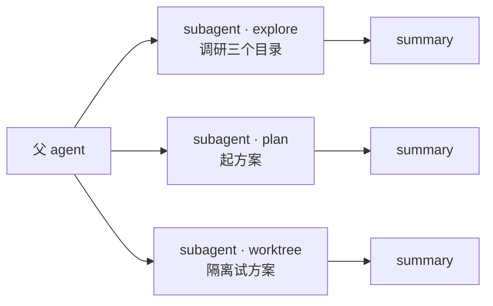
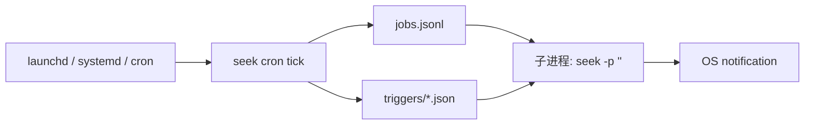

<p align="center">
  
  
  
  
</p>

**Languages**: [English](README.md) · 中文

# seek

**Claude Code 的工作流，DeepSeek 的价格。** 开源、单二进制、跨平台。

```
┌─ seek · deepseek-v4-flash ────────────────── cache 96% · saved $0.42 ─┐
│ /agents (2 active)  · /worktrees (1)  · cron: next @14:30 (12m)       │
└────────────────────────────────────────────────────────────────────── ─┘
```

---

## ⚡ 安装

```bash
OS=$(uname -s | tr '[:upper:]' '[:lower:]')
ARCH=$(uname -m | sed 's/x86_64/amd64/;s/aarch64/arm64/')
VER=$(curl -fsSL https://api.github.com/repos/whyiyhw/seek/releases/latest | sed -nE 's/.*"tag_name":[[:space:]]*"v([^"]+)".*/\1/p')
curl -fsSL "https://github.com/whyiyhw/seek/releases/download/v${VER}/seek_${VER}_${OS}_${ARCH}.tar.gz" \
  | sudo tar -xz -C /usr/local/bin seek
seek
```

首次运行引导设置 API key。Windows 用户走 [`docs/guide-windows.md`](./docs/guide-windows.md)；macOS Gatekeeper / 升级 / 离线安装看 [`docs/`](./docs/)。

---

## 它能做什么

### 子代理 + Worktree 并行（v0.6.0）

模型可以派生子代理并行做调研、起方案、试方案。每个子代理有独立 token 账户、独立 transcript、可选隔离 git worktree。



权限单调收紧（子永远不能松于父），成本自动累加到父状态栏。TUI `/agents` `/worktrees` 实时查看。

### 定时唤醒 + 外部触发（v0.6.1）

借力 OS 调度器，**零常驻 daemon**。可以让 cron 跑定时 prompt、让模型自己说"30 分钟后再来检查"、让 CI / IDE 插件写文件触发。



`seek cron create/list/run` 管定时；`schedule_wakeup` 工具让模型主动安排回访；macOS `osascript` / Linux `notify-send` 自动选择（Windows 通知 v0.6.1 暂为 no-op）。完整启用步骤见 [`docs/guide-cron.md`](./docs/guide-cron.md)。

### 便宜一个数量级

DeepSeek 输入价格（源 `internal/pricing/pricing.go`）：

| 项 | DeepSeek V4-Flash | DeepSeek V4-Pro | Claude Sonnet 4 |
|---|---|---|---|
| 输入（无缓存） | **$0.14** / 1M | **$0.435** / 1M¹ | $3 / 1M |
| 输入（缓存命中） | **$0.0028** / 1M | **$0.003625** / 1M | $0.30 / 1M |
| 输出 | **$0.28** / 1M | **$0.87** / 1M | $15 / 1M |
| 错峰² 折扣 | **再 5 折** | **再 5 折** | — |

> ¹ promo 价 25% 全价。  ² 北京时间 00:30–08:30。

工程纪律保证缓存命中：tool schema 是 `[]byte` 常量、tool 输出大小写入端就限定、历史消息从不在发送前重写。**实测稳态 prefix-cache 命中率 95–97%**。

### 其他能力

- **三层记忆**——S 会话 JSONL、M 项目 `memory_observe` + `/distill`、L 用户 `seek -dream` → `~/.seek/soul.md`
- **双轴权限**——Pref（Deny/Ask/Yolo）× Workflow（None/PlanAnalyze/PlanExecute），workflow 永远 trump pref
- **DeepSeek 专属**——V4 thinking 通过 `think` 工具按需调用、FIM 端点小补全便宜 5–10×、状态栏实时显示 cache 命中 + 错峰倒计时
- **撤销安全网**——每 turn 自动 git checkpoint，`/undo` / `/redo` / `/restore` 文件级回滚
- **Shell hooks + MCP client + Skills v2**——`.seek/hooks.toml` 钩子、MCP server 透传、兼容 [Anthropic Skills 格式](https://docs.anthropic.com/en/docs/claude-code/skills)零修改安装

---

## 工具与命令

### 主入口

```bash
seek                       # TUI
seek -p '<prompt>'         # 一次性打印模式（pipeline 友好）
seek -rpc                  # JSON-RPC 2.0 server（IDE 接入）
seek -resume <sid>         # 续传指定 session（`-continue` 续最近）
```

### 子系统（独立子命令）

```bash
seek skill      install/list/stats/uninstall/update
seek memory     list/show/search/archive
seek cron       create/list/run/delete/tick
seek worktree   list/gc
seek checkpoint list/clean       # 配合 seek undo / seek redo
seek hooks      list/check/trust/audit
seek keys       list/check/actions
```

每个子命令在 TUI 内也以 `/<name>` 形式可用（`/skill use <name>`、`/memory show`、…）。

### TUI 独有

`/plan` 切只读探索；`/steer` 流中插入指令；`/agents` `/worktrees` 编排面板；`/distill` 抽取项目记忆候选；`/review` 一键代码审查。完整 26 个 slash：`/help`。

---

## 路线图

以下全部包含在当前 **v0.7.0** release：

| 阶段 | 已落地 |
|---|---|
| 基础（M0–M10） | DeepSeek 客户端、agent loop、多 provider、session、skill、hooks、checkpoint、plan-mode v2、permission 重构、MCP client、webfetch |
| 编排（柱 G/H） | 子代理 + worktree、cron + 自调度 wakeup + 文件触发 + OS 通知 |
| 单点工具（柱 I/J/M） | AskUserQuestion v2、复合 `code-review` skill、**移动端 webhook 推送桥** |

下一步（柱 K / L）：Monitor + 后台 bash、LSP 工具。

完整 PRD：[`docs/prd/`](./docs/prd/)（v0–v6 umbrella + 14 个 feature PRD）  
贡献：[`AGENTS.md`](./AGENTS.md) · 踩坑：[`docs/pitfalls.md`](./docs/pitfalls.md)

---

## 开源

[MIT](./LICENSE)。无地区限制、无身份审核、无强制 telemetry。灵感来自 [`earendil-works/pi`](https://github.com/earendil-works/pi)（MIT）；归属见 [`NOTICE`](./NOTICE)。

---

*~85k 行 Go（~44k 非测试）· 66 个包 · macOS / Linux / Windows 全平台 -race 通过*
