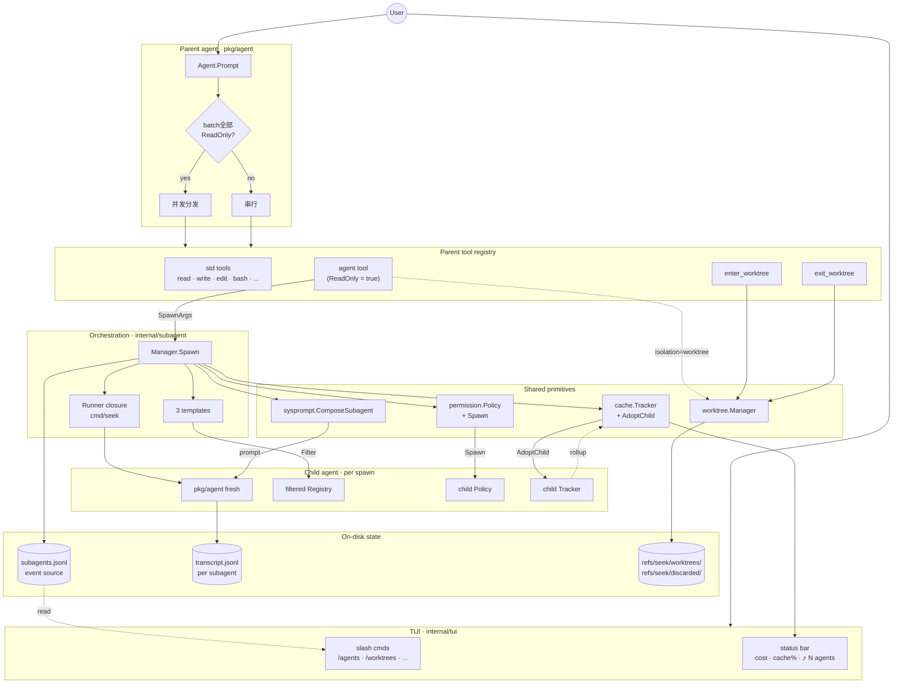

# 第 21 章：M11.0 + M11.1 — v5 柱 G 子代理 + Worktree 隔离

> **对应版本**：v0.6.0
> **对应代码**：`internal/subagent/`、`internal/worktree/`、`internal/tools/{agent,enterworktree,exitworktree}/`、`internal/sysprompt/`、`internal/permission.Policy.Spawn`、`internal/cache.Tracker.AdoptChild`
> **PRD**：[`docs/prd/v5.md`](../prd/v5.md) · [`docs/prd/feature-subagent.md`](../prd/feature-subagent.md)
> **验收**：M11.0 + M11.1 Phase 1+2+3 已全部落地（Phase 3：`/worktrees` TUI 面板 + `seek worktree gc` CLI）
> **起点**：第 20 章（Shell Hooks 可扩展性）。v3 把"可逆性 / 可扩展性 / 可定制性"三柱补齐后，seek 在单 agent 单进程的能力曲线上已对齐 Claude Code 主流形态。但与 Claude Code 对比时浮现一个**架构维度**的空白——多 agent + 调度 + 隔离这一团 P0 缺口（[`docs/comparison.md`](../comparison.md) §10）。v5 接住这一团；本章覆盖**空间维度**的一半，柱 G。

---

## 内容预告

本章核心内容已在 PRD 中详细写明，本章用两张图把**静态结构**与**动态流程**串起来，再点名几条最容易踩坑的设计取舍。完整细节请回 PRD。

## 21.1 单 agent 单进程的两个空白

v0–v4 落地后，dogfood 反复指向同一个缺口：

- **并行研究不可表达**——"同时查 internal/tui · internal/permission · internal/checkpoint 三个包谁处理 Esc"，模型只能挨个 grep；三个独立探索本可以并行，但没有 spawn 机制。
- **长上下文保护不可表达**——子任务"读 50 个文件归纳风格"让父 transcript 膨胀，prefix-cache 复用价值丢失；真正需要回流的只是结论。

v5 柱 G 用一套 orchestration + 一组 primitives 同时解决这两件事：模型可以 spawn 子上下文做研究（`isolation=none`），叠加 worktree 还能做并行实施（`isolation=worktree`），子结束后只把 summary 回填父。

## 21.2 静态结构



**读图三个钩子**：

1. **`agent` 工具是唯一进 `Manager.Spawn` 的入口**——`enter_worktree` / `exit_worktree` 是平级的模型可调原语，但**自动隔离路径**走 `agent` 工具的虚线分支 `isolation=worktree`。
2. **四个 primitives 都加在已有包上做"加法操作"**——`Policy.Spawn` / `Tracker.AdoptChild` / `sysprompt.ComposeSubagent` / `worktree.Manager.Create` 都是 v5 新方法，**不改**老接口。CLAUDE.md 的 "Sink interfaces: don't break the main contract" 原则的延伸。
3. **`refs/seek/` 命名空间复用 v3 checkpoint**——`refs/seek/checkpoints/` / `refs/seek/worktrees/` / `refs/seek/discarded/` 共享同一个不进 default refspec 的家族。git GC 周期自动接管。

## 21.3 Spawn 动态流程

下面这张图覆盖**一次 spawn 从 LLM 触发到结果回流**的完整时序。worktree 路径用 alt 框分离展示。

```mermaid
sequenceDiagram
    participant LLM
    participant ATool as agent tool
    participant WTMgr as worktree.Manager
    participant SMgr as subagent.Manager
    participant Pol as Policy
    participant Trk as Parent Tracker
    participant SP as sysprompt
    participant Idx as subagents.jsonl
    participant Run as Runner
    participant Child as Child Agent

    Note over LLM: parent turn
    LLM->>+ATool: agent({desc, prompt, type, isolation})

    Note over ATool: validate args<br/>desc ≤ 120 · prompt ≤ 32KB<br/>type ∈ {general/explore/plan}

    alt isolation = worktree
        ATool->>+WTMgr: Create("", "")
        Note over WTMgr: git rev-parse HEAD<br/>git worktree add -b seek/wt/&lt;id&gt;<br/>update-ref refs/seek/worktrees/&lt;id&gt;
        WTMgr-->>-ATool: Worktree{path, branch, base}
    end

    ATool->>+SMgr: Spawn(SpawnArgs{<br/>desc, prompt, type, WorktreePath})

    Note over SMgr: capacity gate<br/>len(active) ≥ MaxConcurrent?<br/>→ too_many_subagents wire failure

    SMgr->>Pol: Spawn(cwd, template.Restriction)
    Note over Pol: 双轴 monotonic 收紧<br/>preApproved 永不继承
    Pol-->>SMgr: child Policy

    SMgr->>Trk: cache.New() + AdoptChild
    Note over Trk: 父持子引用<br/>Cumulative() 透传遍历

    SMgr->>SP: ComposeSubagent(Header, Role)
    Note over SP: 段 1-3 与父字节相同<br/>段 4 替换为 subagent role + summary hint
    SP-->>SMgr: system prompt

    SMgr->>Idx: appendEvent("started",<br/>sub_sid, type, desc, WorktreePath)

    SMgr->>+Run: Runner(RunnerJob)
    Note over Run: filter parent reg<br/>by template.ToolNames

    Run->>+Child: agent.New(Config) + Prompt(UserPrompt)

    loop until terminal turn
        Child->>Child: LLM call → tool calls<br/>→ tool dispatch
        Child->>Trk: Record(Usage)
        Note over Trk: 写入 child Tracker<br/>父 Cumulative 透传可见
    end

    Child-->>-Run: events stream + final messages
    Note over Run: 提取最末<br/>无 ToolCalls 的<br/>assistant message
    Run-->>-SMgr: RunnerResult{Summary, Tokens, Turns}

    SMgr->>Idx: appendEvent("completed", Tokens)

    Note over SMgr: 异常分支<br/>· ctx.Canceled by Kill → "killed"<br/>· ctx.Canceled by parent → "failed canceled"<br/>· DeadlineExceeded → "failed timeout"<br/>· Runner panic → "failed spawn_error"

    SMgr-->>-ATool: Result{Summary, Status, Tokens}

    alt isolation = worktree
        ATool->>+WTMgr: Cleanup(path, "keep")
        Note over WTMgr: git status --porcelain
        alt clean
            WTMgr->>WTMgr: git worktree remove --force<br/>+ update-ref -d
            WTMgr-->>ATool: status="cleaned"
            Note over ATool: summary 不追加<br/>(无改动静默 cleaned)
        else dirty + keep
            WTMgr-->>ATool: status="kept", changes=N
            Note over ATool: summary 追加<br/>"— worktree: path<br/>(branch X, N changes)"
        end
    end

    ATool-->>-LLM: [agent: completed] headline<br/><br/>summary body<br/><br/>footer: sub-sid · turns · tokens
```

**读图三个钩子**：

1. **失败分支全部走"结构化 wire format"，永不抛 Go error**——无论是 capacity gate / Policy.Spawn / git create / runner panic / ctx cancel，最终都化作 `[agent: failed reason=<X>]` 字节序列回到 LLM。模型读 prefix 决定下一步，没有"工具崩了不知道为啥"的盲区。
2. **AdoptChild 是 spawn 流程里**唯一**在 child Tracker 写入之前就建立的链路**——这一步发生在 LLM 还没真正调起来时。原因是父端 `Cumulative()` 的并发读路径（状态栏每帧刷新）要在子开始 record 之前就能看见子，否则父 cost 会短暂不准。
3. **Cleanup 用 `context.Background` 而不是父 ctx**——父 turn 被 Esc 取消时不该让 worktree 卡半态。cleanup 延迟有界（git status + remove），不影响响应性。

## 21.4 四个 primitives 的"加法操作"

每一个都是给已有包加一个新方法或新类型，不改老接口。

### 21.4.1 `permission.Policy.Spawn(cwd, Restriction)` — 双轴 monotonic 收紧

`Preference × Workflow` 两轴**只能向下传**：

- Pref：`Deny < Ask < Yolo`，`childPref > parentPref` 直接拒绝
- Workflow：非全序，按 case 显式枚举允许集（PlanAnalyze 终态、PlanExecute → PlanExec/PlanAnalyze、None → 任意）
- `preApproved` **永不继承**——即使子留在 PlanExecute，父的"auto-approve 当前 step"窗口不传给新子 agent。

子拿到**独立的** `mu` / `askFn` / `onDestructive`，父子互不阻塞。`Cwd()` 是新增的只读 accessor——`worktree` 子 spawn 时把 worktree 路径传进去做子 cwd，保留 Policy.cwd 构造期不可变的不变式。

### 21.4.2 `cache.Tracker.AdoptChild(child)` — 父子引用 + snapshot-then-release

```go
func (t *Tracker) Cumulative() deepseek.Usage {
    t.mu.Lock()
    // ... aggregate own turns ...
    children := append([]*Tracker(nil), t.children...)  // ← 关键：快照
    t.mu.Unlock()                                       // ← 释放父锁
    for _, c := range children {
        cu := c.Cumulative()  // ← 递归子，父锁已不持有
        // ...
    }
    return sum
}
```

**snapshot-then-release** 是这里**唯一**有意思的设计——若用 `defer t.mu.Unlock()` 简单写法，父锁会被 children 的递归 `Cumulative()` 持有时间放大，阻塞并发 `Record`。这条约束有专用 race 测试守门（`TestTracker_AdoptChild_ConcurrentCumulativeDoesNotDeadlock`）。

嵌套 spawn (`depth > 1`) 直接 panic 作为 v5 spawn 深度=1 的第二道防线（第一道：`agent` 工具在 child Registry 里不注册）。

### 21.4.3 `sysprompt.ComposeSubagent(Header, Role)` — header 字节复用

父子的 system prompt 共享前 3 段（identity + project section + skill manifest）**字节相同**；第 4 段父用 `Mode: <label>`，子替换为：

```
You are a subagent spawned by the parent agent for: <desc>.
Complete the task and return a concise summary as your final message.
[Extra clause — explore: research-only; plan: numbered structured plan]
Your final assistant message will be returned to the parent as a summary.
Keep it within ~4000 characters; content past that will be truncated.
```

为什么前 3 段字节相同：让子也享受 prefix cache 命中（即便子的 cache 曲线与父独立）。

抽这一段到独立包是为了避免 `cmd/seek` 与 `internal/subagent` 双份代码漂移。Golden 测试断言字节级与旧 cmd/seek inline 装配等价。

### 21.4.4 `worktree.Manager` — refs/seek/ 命名空间复用 v3

Manager 拷贝了 v3 checkpoint 的 `gitRunner` 注入模式（导出为 `GitRunner` 类型方便跨包测试）。三件关键事：

- **路径**：`~/.seek/projects/<pid>/worktrees/<wt-id>/`
- **Ref**：`refs/seek/worktrees/<wt-id>` 不进 default refspec
- **discard 救命栈**：`exit_worktree if_dirty=discard` 先 `git stash create` 到 `refs/seek/discarded/<ts>` **才** hard-reset。`stash create` 失败必 abort —— 不能在没有 rescue 副本前就 nuke dirty 内容
- **GC**：`PruneDiscarded(olderThan)` 走启动时被动 + `seek worktree gc` 显式两条路径，零常驻 daemon（PRD §2.5 约束）

## 21.5 Manager.Spawn 的 11 步

时序图上看是连续流，代码上是十一步固定顺序：

1. 验证 args（type / desc / prompt 非空）
2. capacity gate（`len(active) ≥ MaxConcurrent` → 即刻失败 `too_many_subagents`）
3. `Policy.Spawn(cwd, restriction)` —— 失败 → `spawn_error`
4. `cache.New()` + `parent.AdoptChild(child)` —— 不会失败
5. 生成 sub_sid + mkdir session dir
6. `sysprompt.ComposeSubagent(header, role)` —— 不会失败
7. 写 `started` event 到 jsonl —— 失败 → `spawn_error`
8. 在 `m.active` 注册 + 创建 `ctx, cancel`
9. 调 `Runner(ctx, job)` 进入 LLM 循环（**这一步可能十几秒到几分钟**）
10. 在 `m.active` 删除 + 检查 killedByUser 标记
11. 按 (runErr, killed) 分类四种终态事件 + 包装 wire-format Result

步骤 1-8 + 11 都在毫秒级；步骤 9 决定整个 Spawn 的延时。

## 21.6 三个 subagent_type 模板

| type | 工具子集 | Restriction | Extra clause |
|---|---|---|---|
| `general-purpose` | 父全集 减 `agent`/`ask_user` | inherit | 无 |
| `explore` | read · grep · list_dir · git · webfetch · think | Workflow=`PlanAnalyze` | "research-only mode" |
| `plan` | 同 explore（C.2 窄化后）| Workflow=`PlanAnalyze` | "numbered structured plan in summary" |

`plan` 的窄化是 M11.0 production wiring 时被迫做的决定（§21.8 详述）。

## 21.7 工具表达层

三个 LLM-facing 工具，schema 字节全部是 package-level 常量：

- **`agent`**：MarkedReadOnly（语义伸展，dispatch 概念而非 permission 概念）。让批量 `[agent, agent]` 走 `pkg/agent` 分区派发的并发侧（`readOnlyCall()` 逐调用判定）。
- **`enter_worktree`**：返回 `[worktree: created path=... branch=... base=...]`
- **`exit_worktree`**：根据 status 返回 cleaned / kept / discarded 三种 wire format

`agent` 工具的 `isolation="worktree"` 是隐式 enter+exit 组合，**子结束后自动 keep** — dirty 内容留给用户 review，模型用 summary 反馈"东西在哪儿"。

## 21.8 已知限制：Policy passthrough + 三层硬安全

**问题**：production Runner 复用父 reg 的 Tool 实例。这些工具在父 reg 构造时已绑死父 Policy 引用。所以子的 `Workflow=PlanAnalyze` 在工具 `Check()` 层**不被强制**——PRD §2.3 monotonic-收紧 promise 在这一路径上软化。

**M11.0 ship-with 三层兜底**：

| 模板 | 安全机制 |
|---|---|
| `explore` | 工具白名单不含 write/edit/bash —— 硬安全 |
| `plan` | C.2 窄化为同 explore 的只读子集 —— 硬安全 |
| `general-purpose` | 继承父 Policy 是设计意图 —— passthrough 等价于父 |

**未决 follow-up**（feature-subagent.md §9 v0.6.x dot）：**per-spawn Registry 重建**——把 6 个吃 Policy 的工具（read/write/edit/bash/memorytool.Remember/skillinstall.Commit）在 Manager.Spawn 时用 childPolicy 重构造，让 PRD §2.3 在 tool gate 级别也 hard-enforce，届时可放开 `plan` 模板的工具子集，让它真正持有 `propose`（同时需要解决 propose sink 跨上下文污染）。

## 21.9 一个观察：从"单上下文流"到"可分裂上下文"的换挡

v0-v4 的所有功能加在一起，agent 是一条**单向、单流**的对话：用户输入 → 父 turn 转动 → 工具调用 → 输出。所有状态、上下文、token 预算共用一个池子。

v5 柱 G 第一次把这条主流**显式可分裂**——`agent` 工具一旦被调用，模型说"这一段子任务的上下文不要污染主流"，orchestration 就把权限单调收紧、把成本独立计量、把转录单独落盘、把工作目录可选隔离。返回时只有 4 KB 的 summary 进主流字节序列。

这不只是"加并发"或"加性能"。它是 agent 模型从"个人助理"演化到"小团队 lead"的换挡——主 agent 学会分派 / 收集 / 综合，而不是亲自下手做所有事。

[第 22 章](chapter-22.md)接住了**时序维度**那一半（v5 柱 H：cron / wakeup / push），让 agent 摆脱"用户敲完回车才跑"的同步约束。

---

**关键提交序列**（git log --oneline，按推进顺序）：

```
docs(prd): v5 代理编排 umbrella + 柱 G subagent + inspect RPC      [eb36667]
feat(M11.0): Policy.Spawn + Tracker.AdoptChild — v5 柱 G foundations [ec3f9cd]
refactor(sysprompt): extract system prompt assembly                 [8af0acd]
feat(M11.0): internal/subagent — orchestrator                       [ff7bbe3]
feat(M11.0): internal/tools/agent — LLM-facing subagent tool        [dcc1cd1]
feat(M11.0): wire subagent.Manager + agent tool into cmd/seek       [8b4f72b]
fix(M11.0): agent tool implements ReadOnlyTool — parallel dispatch  [ac6edf7]
refactor(M11.0): C.2 — narrow plan subagent template to read-only   [8a4a73f]
feat(M11.0): /agents TUI surface — slash command + status bar badge [ebc5639]
fix(M11.0): /agents column order matches PRD §4.2                   [68abd00]
fix(M11.0): /agents defaults to current session, --all widens       [125b756]
feat(M11.1): worktree primitive + enter/exit_worktree tools         [679f7c7]
feat(M11.1): agent.isolation=worktree end-to-end (Phase 2)          [ddaab85]
```


---

### 相关踩坑

子代理与工作树隔离实现中遇到的具体问题，以下是来自 [`docs/pitfalls.md`](../pitfalls.md) 的详细记录：

**1. Worktree 隔离的子代理写入了主仓库**

- **Saw**：隔离模式 spawn 的子代理应该在工作树内操作，但 `README.md` 的修改落在了主仓库的工作目录中。
- **Why**：工作树内的 `git` 命令仍然可以访问主仓库的 refs 和 objects，且文件路径解析如果不限制为工作树前缀，就会触及主仓库。
- **Fix**：在 `enter_worktree` 工具和 Manager 中增强路径隔离——子进程的 `cwd` 设置为工作树根，工作树根的父目录不可写。

**2. Windows 上工作树面板为空**

- **Saw**：`/worktrees` 面板在 Windows 上不显示存在的 seek 管理工作树。
- **Why**：git 输出的路径使用正斜杠（`dir/file`），而 `filepath` 在 Windows 上使用反斜杠（`dir\file`）。`strings.HasPrefix(path, worktreeRoot)` 匹配失败。
- **Fix**：比较路径前规范化分隔符（统一为正斜杠），或使用 `filepath.Rel` 替代前缀比较。

**3. `ReadOnlyTool` 是并行调度的开关**

- **Saw**：一轮中 spawn 多个子 agent 时，它们串行执行而非并行。
- **Why**：`agent` 工具没有实现 `ReadOnlyTool` 接口，调度器不知道它可以安全并行。
- **Fix**：给 agent tool 加上 `ReadOnly() bool { return true }` 方法。

详见 [`docs/pitfalls.md`](../pitfalls.md) 全文——130+ 条持续更新的踩坑记录。

阅读本章前建议先读 PRD `v5.md` + `feature-subagent.md`，再 `go test -race ./internal/subagent/... ./internal/worktree/... ./internal/tools/{agent,enterworktree,exitworktree}/...` 跑一遍验收测试理解边界行为。
